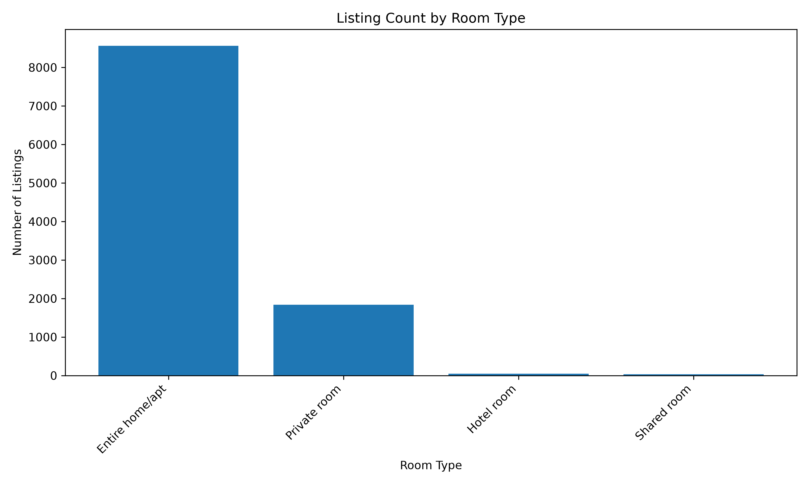
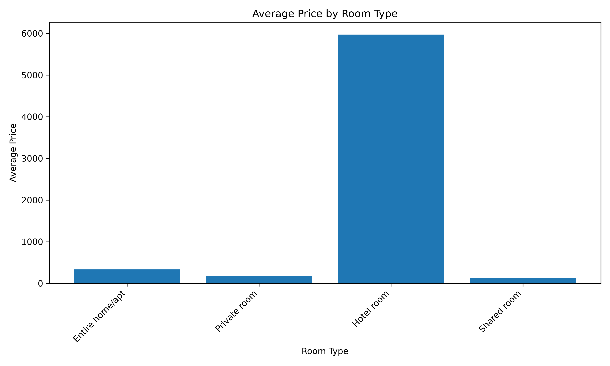
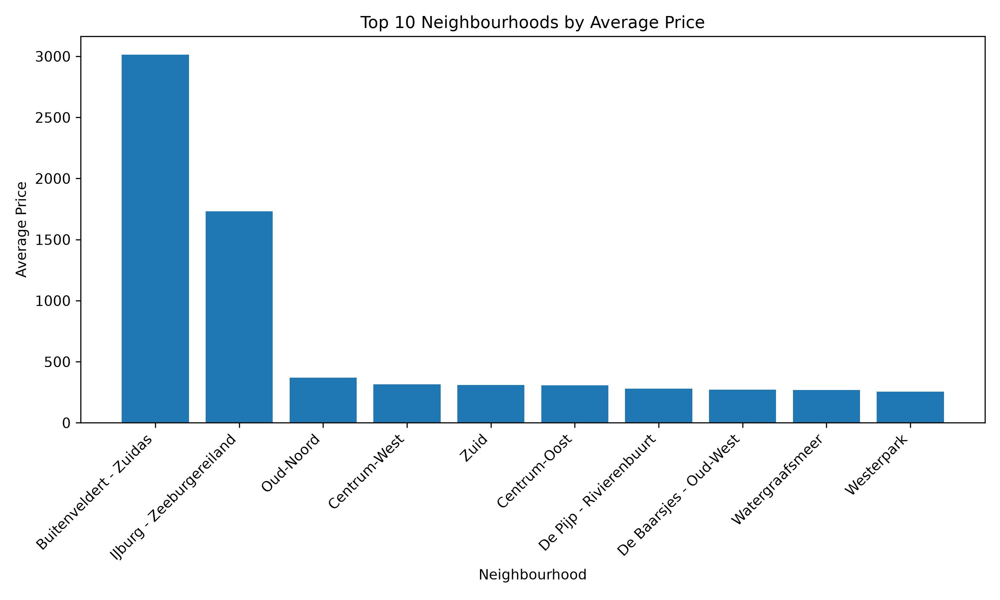
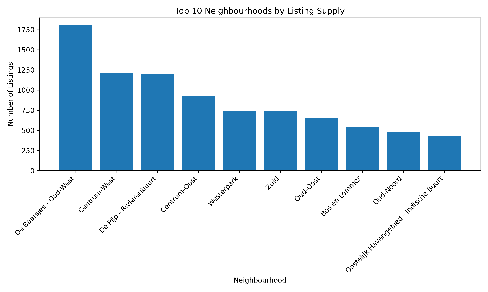
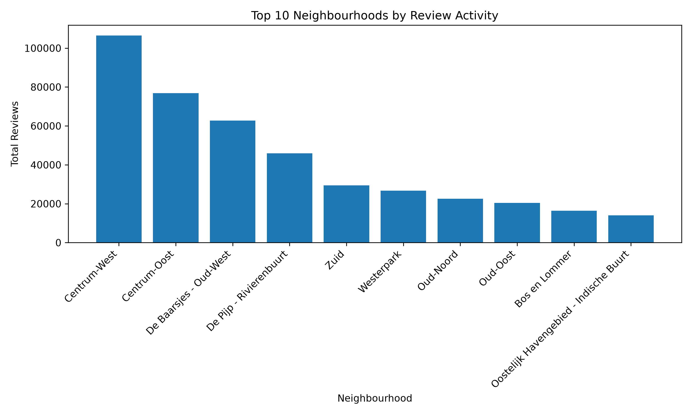
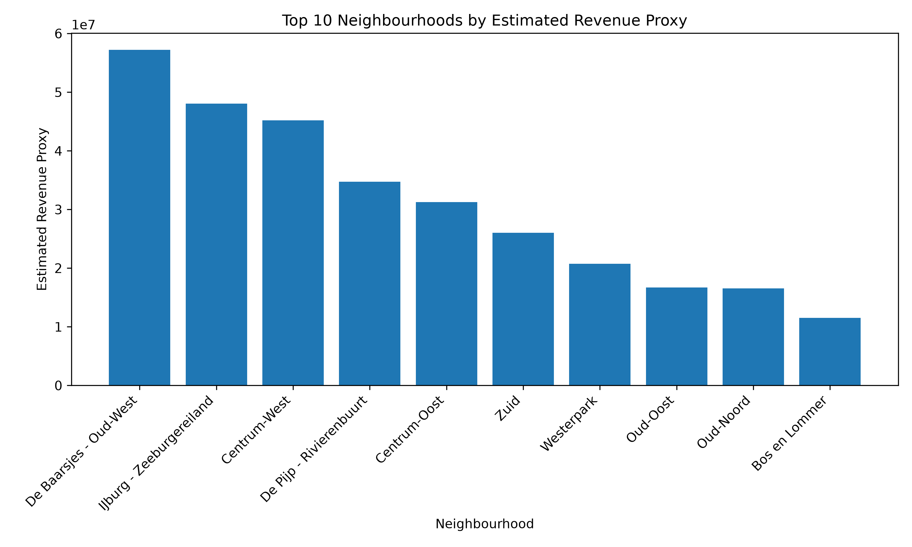

# Inside Airbnb Market Intelligence Data Engineering Pipeline

## Data Engineer Intern Technical Assessment

**Candidate:** Oshan Rajakaruna

**Role:** Data Engineer Intern

**Dataset:** Inside Airbnb Public Dataset – Amsterdam, North Holland, The Netherlands

**Submission Format:** GitHub Repository + PDF Report + Optional Power BI Dashboard

---

# Table of Contents

1. Executive Summary
2. Objectives and Scope
3. Dataset Overview
4. Methodology
5. Engineering Approach
6. Data Quality Findings
7. Data Model
8. SQL Analysis Findings
9. Exploratory Data Analysis Findings and Power BI Dashboard
10. Statistical Findings
11. Business Recommendations
12. Limitations and Caveats
13. Future Improvements
14. Reflection and Prioritization
15. Completed Work Summary
16. Incomplete or De-scoped Work Summary
17. Appendix A: AI Usage Disclosure Summary
18. Appendix B: Key SQL Queries and Outputs

---

# 1. Executive Summary

This project presents a reproducible data engineering and market intelligence workflow using the public Inside Airbnb dataset. The objective was to transform raw short-term rental market data into cleaned, validated, analytics-ready datasets and generate business insights related to listing supply, pricing, availability, host behavior, review activity, and neighbourhood-level market dynamics.

The selected Amsterdam dataset contains 10,480 listings, 3,825,200 calendar records, 501,084 review records, and 22 neighbourhood records. The project focused on one city dataset to prioritize depth, reproducibility, data quality, and clear business interpretation rather than attempting broad but shallow multi-city analysis.

A complete Python-based pipeline was implemented to validate raw files, profile the dataset, clean and transform raw data, create listing-level summary tables, load outputs into DuckDB, build a simple star-schema-style dimensional model, run SQL analysis, generate visualizations, and perform statistical hypothesis testing. The full workflow can be executed with one command:

```bash
python main.py
```

A three-page Power BI dashboard was also created using curated pipeline outputs. The dashboard provides an executive market overview, demand/revenue proxy and host insights, and a data quality and pipeline monitoring view for stakeholder-friendly exploration.

The analysis found that the market is strongly dominated by entire-home/apartment listings, with 8,561 out of 10,480 listings belonging to this room type. The average availability rate across listings was approximately 25.77%, while the calculated occupancy proxy was approximately 74.23%. These values should be interpreted carefully because unavailable calendar days may represent booked nights, blocked dates, maintenance periods, or host restrictions.

A key data limitation was discovered during profiling: calendar-level price values were unavailable. Because of this, daily price analysis, weekend-versus-weekday price comparisons, and seasonal price trend analysis were intentionally de-scoped. Listing-level price from the listings dataset was used for price analysis, while calendar data was used only for availability and occupancy proxy calculations.

From a business perspective, the findings suggest that the selected market is highly concentrated around full-property rentals, with strong review activity and clear neighbourhood-level variation in pricing and supply. The project also demonstrates that a reliable data pipeline should not only generate insights, but also clearly document limitations, data quality issues, assumptions, and trade-offs.

---

# 2. Objectives and Scope

## 2.1 Project Objectives

The main objectives of this project were to:

* Understand and profile the raw Inside Airbnb dataset.
* Validate expected raw files before processing.
* Clean and standardize listing, calendar, review, and neighbourhood data.
* Create analytics-ready datasets suitable for SQL analysis and reporting.
* Build a lightweight analytical database using DuckDB.
* Implement a simple star-schema-style dimensional model.
* Run SQL-based market analysis.
* Generate visualizations for business storytelling.
* Perform statistical tests to support analytical findings.
* Export curated datasets for Power BI dashboarding.
* Create a Power BI dashboard for business stakeholder exploration.
* Document data limitations, assumptions, decisions, and de-scoped work.
* Provide a reproducible workflow with clear execution instructions.

## 2.2 Scope Selection

The assignment was intentionally broad, covering data engineering, exploratory analysis, statistics, machine learning, AI experimentation, and innovation opportunities. For this submission, the scope was intentionally focused on the areas most relevant to the Data Engineer Intern role:

* Data ingestion and validation
* Dataset profiling
* Data cleaning and transformation
* Data quality checks
* Dimensional modeling
* SQL analysis
* EDA visualizations
* Statistical testing
* Power BI dashboarding
* Documentation and reproducibility

The Amsterdam dataset was selected as the single-city scope instead of analyzing multiple cities. This decision was made to prioritize quality, technical depth, reproducibility, and clear reasoning. Multi-city analysis was considered but intentionally de-scoped to avoid shallow implementation and to focus on building a strong end-to-end pipeline.

## 2.3 De-scoped Areas

The following areas were intentionally not implemented:

* Multi-city comparison
* Machine learning price prediction
* LLM/RAG system over reviews
* AI analyst assistant
* Cloud deployment
* Docker containerization
* Advanced dbt implementation
* Full geospatial dashboarding

These areas are discussed in the Future Improvements section as possible extensions.

---

# 3. Dataset Overview

## 3.1 Dataset Source

The project uses the public Inside Airbnb dataset for Amsterdam, North Holland, The Netherlands. The dataset was downloaded on 21 June 2026 from the Inside Airbnb data portal. Inside Airbnb provides publicly available short-term rental data including listing attributes, host details, pricing information, availability calendars, guest reviews, and neighbourhood-level geographic references.

The selected dataset contains the following raw files:

| File                     | Purpose                                                                                                    |
| ------------------------ | ---------------------------------------------------------------------------------------------------------- |
| `listings.csv.gz`        | Listing-level data including price, room type, host information, location, availability, and review scores |
| `calendar.csv.gz`        | Daily listing availability data                                                                            |
| `reviews.csv.gz`         | Review-level data including reviewer, date, listing reference, and comments                                |
| `neighbourhoods.csv`     | Neighbourhood reference data                                                                               |
| `neighbourhoods.geojson` | Geographic neighbourhood boundary data                                                                     |

## 3.2 Dataset Size

After profiling the raw Amsterdam files, the dataset contained:

| Dataset        |      Rows | Columns |
| -------------- | --------: | ------: |
| Listings       |    10,480 |      79 |
| Calendar       | 3,825,200 |       7 |
| Reviews        |   501,084 |       6 |
| Neighbourhoods |        22 |       2 |

The calendar dataset is the largest file because it contains one row per listing per calendar date.

## 3.3 Business Entities

The main business entities represented in the dataset are:

### Listing

A listing represents a short-term rental unit available on Airbnb. It includes information such as listing name, room type, property type, neighbourhood, price, capacity, availability, and review metrics.

### Host

A host represents the person or business entity managing one or more listings. Host-level fields include host ID, host name, host tenure, superhost status, and listing count.

### Calendar Record

A calendar record represents a listing’s availability on a specific date. In this project, calendar data was used to calculate availability rate and occupancy proxy.

### Review

A review represents guest feedback associated with a listing. Review data was used as a demand/activity proxy and to evaluate review volume across listings and neighbourhoods.

### Neighbourhood

A neighbourhood represents a geographical area within the selected city. It allows market-level analysis by location.

## 3.4 File Relationships

The main relationships between files are:

| Relationship               | Join Key                                                         |
| -------------------------- | ---------------------------------------------------------------- |
| Listings to Calendar       | `listings.id = calendar.listing_id`                              |
| Listings to Reviews        | `listings.id = reviews.listing_id`                               |
| Listings to Neighbourhoods | `listings.neighbourhood_cleansed = neighbourhoods.neighbourhood` |

The listing dataset acts as the central entity. Calendar and review records are linked back to listings using `listing_id`.

## 3.5 Important Data Limitation

A major limitation was identified during profiling: the calendar-level price field was unavailable for all calendar summary records. This means that daily pricing analysis could not be performed reliably.

Because of this limitation:

* Calendar data was not used for daily price analysis.
* Weekend-versus-weekday price testing was not performed.
* Listing-level price was used for price analysis.
* Calendar data was used only for availability and occupancy proxy calculations.

This limitation was documented in the decision log and reflected in the analysis scope.

---

# 4. Methodology

## 4.1 Overall Approach

The project followed a structured data engineering workflow:

1. Validate raw files.
2. Profile raw datasets.
3. Clean and standardize key fields.
4. Create aggregated summary tables.
5. Build an enriched listing master table.
6. Load processed data into DuckDB.
7. Create a simple dimensional model.
8. Run SQL analysis.
9. Generate EDA visualizations.
10. Perform statistical hypothesis testing.
11. Export curated datasets for Power BI dashboarding.
12. Document assumptions, limitations, decisions, and results.

## 4.2 Pipeline Flow

The pipeline follows this flow:

```text
Raw Inside Airbnb Files
        ↓
Raw File Validation
        ↓
Dataset Profiling
        ↓
Data Cleaning and Standardization
        ↓
Calendar and Review Aggregation
        ↓
Listing Master Table
        ↓
DuckDB Analytical Database
        ↓
Dimensional Model
        ↓
SQL Analysis
        ↓
Visualizations, Statistical Tests, and Power BI Export
        ↓
Business Dashboard and Final Findings
```

## 4.3 Tools Used

| Tool       | Purpose                                                   |
| ---------- | --------------------------------------------------------- |
| Python     | Main programming language                                 |
| Pandas     | Data cleaning, profiling, transformation, and aggregation |
| NumPy      | Numeric operations                                        |
| DuckDB     | Local analytical database and SQL execution               |
| SQL        | Market analysis and data quality checks                   |
| Matplotlib | Visualization generation                                  |
| SciPy      | Statistical hypothesis testing                            |
| Power BI   | Business intelligence dashboarding                        |
| GitHub     | Version control and submission repository                 |

## 4.4 Reproducibility

The full project can be reproduced by installing the dependencies, placing the raw Inside Airbnb files in `data/raw/`, and running:

```bash
python main.py
```

The pipeline regenerates profiling outputs, processed files, DuckDB tables, quality checks, SQL results, visualizations, statistical outputs, and curated Power BI export datasets.

---

# 5. Engineering Approach

## 5.1 Repository Structure

The repository was organized to separate raw data, processed data, source code, SQL scripts, reports, and generated outputs.

```text
.
├── dashboard/
│   └── inside_airbnb_market_dashboard.pbix
├── data/
│   ├── raw/
│   └── processed/
├── outputs/
│   ├── figures/
│   └── tables/
├── reports/
├── sql/
├── src/
│   ├── extract.py
│   ├── profile_data.py
│   ├── transform.py
│   ├── load.py
│   ├── quality_checks.py
│   ├── run_analysis.py
│   ├── generate_visuals.py
│   ├── statistical_analysis.py
│   └── export_powerbi_data.py
├── main.py
├── requirements.txt
└── README.md
```

Raw and processed datasets were excluded from Git because they can be regenerated using the pipeline and may increase repository size. Small output summaries, generated figures, Power BI screenshots, and the Power BI dashboard file were included to help reviewers quickly inspect results.

## 5.2 Raw File Validation

The `extract.py` script validates whether all expected raw files are available:

* `listings.csv.gz`
* `calendar.csv.gz`
* `reviews.csv.gz`
* `neighbourhoods.csv`
* `neighbourhoods.geojson`

It generates `raw_file_manifest.csv`, which records file names, paths, availability status, and file sizes.

## 5.3 Data Profiling

The `profile_data.py` script profiles each input file by calculating:

* Row counts
* Column counts
* Duplicate row counts
* Missing value counts
* Missing value percentages
* Data types
* Unique value counts
* Sample values

This profiling step was important because it identified major data limitations before transformation, especially the missing calendar-level price values.

## 5.4 Data Cleaning and Standardization

The `transform.py` script standardizes and prepares the raw data for analysis.

Key cleaning actions included:

* Converting price values from text format to numeric format.
* Parsing date fields into proper date types.
* Converting `t/f` values into Boolean values.
* Converting numeric columns to appropriate numeric types.
* Renaming columns for consistency.
* Creating host tenure in years.
* Aggregating calendar records at listing level.
* Aggregating review records at listing level.
* Creating the enriched `listing_master.csv` table.

## 5.5 Calendar Aggregation

The calendar dataset contained 3,825,200 rows. To make it easier to analyze, the data was aggregated to listing level.

The calendar summary includes:

* `calendar_days`
* `available_days`
* `unavailable_days`
* `availability_rate`
* `occupancy_proxy`
* `calendar_price_non_null`

The occupancy proxy is calculated as:

```text
unavailable_days / calendar_days
```

This metric is useful as a directional demand signal, but it should not be interpreted as confirmed occupancy.

## 5.6 Review Aggregation

Review records were aggregated to listing level to create:

* `total_reviews`
* `first_review_date`
* `latest_review_date`

Review activity was used as a proxy for demand and guest engagement.

## 5.7 Listing Master Table

The `listing_master.csv` table combines:

* Cleaned listing attributes
* Calendar availability metrics
* Review activity metrics

This table provides one row per listing and acts as the main analytics-ready dataset for SQL analysis, visualization, and statistical testing.

## 5.8 DuckDB Loading

The `load.py` script loads processed outputs into DuckDB and creates analytical tables.

DuckDB was selected because it is lightweight, fast for analytical SQL, and easy to run locally without server configuration.

## 5.9 Pipeline Automation

The `main.py` script runs the full workflow in the correct order:

1. Extract / raw file validation
2. Data profiling
3. Data transformation
4. DuckDB loading and dimensional model creation
5. Data quality checks
6. SQL market analysis
7. EDA visual generation
8. Statistical analysis
9. Power BI dataset export

This provides a reproducible pipeline that can be executed with a single command.

## 5.10 Power BI Dataset Export

The `export_powerbi_data.py` script creates curated CSV files specifically for Power BI dashboarding. These files are generated from the cleaned pipeline outputs rather than from raw data files.

The Power BI export outputs are:

```text
outputs/tables/powerbi/listing_master_powerbi.csv
outputs/tables/powerbi/data_quality_checks_powerbi.csv
```

This approach keeps the dashboard connected to the reproducible data engineering workflow and avoids manually preparing dashboard data outside the pipeline.

---

# 6. Data Quality Findings

## 6.1 Data Quality Checks Implemented

The project implemented automated data quality checks covering:

* Duplicate listing IDs
* Missing listing prices
* Non-positive prices
* Missing room types
* Invalid coordinates
* Listings without calendar summary
* Listings without review summary
* Calendar records with missing price
* Invalid availability rate
* Reviews missing listing ID

## 6.2 Quality Check Results

| Check                             | Result |
| --------------------------------- | -----: |
| Duplicate listing IDs             |      0 |
| Missing listing prices            |  4,606 |
| Non-positive prices               |      0 |
| Missing room type                 |      0 |
| Invalid coordinates               |      0 |
| Listings without calendar summary |      0 |
| Listings without review summary   |  1,097 |
| Calendar records missing price    | 10,480 |
| Invalid availability rate         |      0 |
| Reviews missing listing ID        |      0 |

## 6.3 Interpretation

The dataset had no duplicate listing IDs, no invalid coordinates, no non-positive prices, and no missing room type values. This supports the reliability of listing-level analysis.

However, 4,606 listings had missing listing-level price values. These records were excluded from price-based calculations. This was treated as an expected data limitation rather than an error.

The calendar-level price field was unavailable for all listings in the calendar summary. Because of this, calendar data was used only for availability analysis, not daily pricing analysis.

There were also 1,097 listings without review summary records. These listings may have no reviews in the selected dataset period. This affects review-based analysis and is documented as a limitation.

---

# 7. Data Model

## 7.1 Dimensional Modeling Approach

A simple star-schema-style dimensional model was implemented in DuckDB. The goal was to separate descriptive entities from analytical metrics and support SQL-based business analysis.

The model includes:

### Dimension Tables

* `dim_listing`
* `dim_host`
* `dim_neighbourhood`

### Fact Tables

* `fact_listing_market`
* `fact_reviews`

## 7.2 Dimension Tables

### `dim_listing`

Contains descriptive listing attributes such as:

* Listing ID
* Listing name
* Property type
* Room type
* Accommodates
* Bedrooms
* Beds
* Minimum nights
* Maximum nights

### `dim_host`

Contains host-level information such as:

* Host ID
* Host name
* Host since date
* Host tenure years
* Superhost status
* Host listing count

### `dim_neighbourhood`

Contains neighbourhood-level reference data.

## 7.3 Fact Tables

### `fact_listing_market`

This is the main analytical fact table. It stores listing-level measures such as:

* Price
* Availability
* Available days
* Unavailable days
* Availability rate
* Occupancy proxy
* Review counts
* Review scores
* Estimated revenue proxy

### `fact_reviews`

This table stores review-level activity and links reviews back to listings.

## 7.4 Relationship Overview

The main relationships are:

| Fact Table            | Dimension Table     | Join Key        |
| --------------------- | ------------------- | --------------- |
| `fact_listing_market` | `dim_listing`       | `listing_id`    |
| `fact_listing_market` | `dim_host`          | `host_id`       |
| `fact_listing_market` | `dim_neighbourhood` | `neighbourhood` |
| `fact_reviews`        | `dim_listing`       | `listing_id`    |

This model is suitable for the assessment scope and supports analytical queries around listing supply, pricing, host behavior, review activity, and neighbourhood-level patterns.

## 7.5 Production Data Model Extension

For a production-grade warehouse, the model could be extended with:

* Surrogate keys
* Slowly Changing Dimension Type 2 for listings and hosts
* `dim_date`
* `dim_room_type`
* `dim_property_type`
* `dim_amenity`
* `bridge_listing_amenity`
* Daily calendar fact table
* Listing snapshot fact table
* Host market snapshot fact table

This would support multi-city analysis, history tracking, Power BI reporting, and scalable analytical workloads.

---

# 8. SQL Analysis Findings

## 8.1 Market Overview

The selected market contains:

* 10,480 listings
* 9,201 hosts
* 22 neighbourhoods
* Average availability rate: 25.77%
* Occupancy proxy: 74.23%

This indicates a market with a large number of unique hosts and relatively low average availability. The occupancy proxy suggests strong unavailable-day activity, but this should be interpreted carefully because unavailable days do not always represent confirmed bookings.

## 8.2 Room Type Supply

The market is dominated by entire-home/apartment listings.

| Room Type       | Listing Count |
| --------------- | ------------: |
| Entire home/apt |         8,561 |
| Private room    |         1,839 |
| Hotel room      |            49 |
| Shared room     |            31 |

This suggests that the market is primarily oriented toward full-property rentals rather than shared accommodation. For market strategists, this indicates that competition is likely strongest among full-home listings.

## 8.3 Business Interpretation

The dominance of entire-home/apartment listings suggests that the selected Airbnb market is positioned more toward independent stays, families, groups, and travelers seeking full-property privacy. Private rooms still represent a meaningful but smaller segment, while hotel rooms and shared rooms are niche categories.

For hosts, this means private-room listings may need to compete more strongly on affordability, location, guest experience, and review quality. For market analysts, room type should be treated as a major driver when evaluating pricing and supply patterns.

---

# 9. Exploratory Data Analysis Findings

## 9.1 Visualization Overview

Exploratory data analysis was performed using SQL output tables and Python-generated visualizations. The goal was not only to describe the data, but also to translate observed patterns into business meaning.

The following visualizations were generated:

* Listing count by room type
* Average price by room type
* Top neighbourhoods by average price
* Top neighbourhoods by listing supply
* Review activity by neighbourhood
* Estimated revenue proxy by neighbourhood

These charts are available in the `outputs/figures/` directory.

## 9.2 Listing Count by Room Type



The room type distribution shows that the Amsterdam Airbnb market is heavily dominated by entire-home/apartment listings. Out of 10,480 listings, 8,561 are entire-home/apartment listings, while 1,839 are private rooms. Hotel rooms and shared rooms represent only a small share of the market.

### Business Interpretation

This suggests that the Amsterdam market is primarily structured around full-property rentals rather than shared accommodation. For revenue strategists and market analysts, this means that competitive pressure is likely highest among entire-home listings. Hosts in this segment may need to differentiate through location, price, guest experience, amenities, and review quality.

Private rooms still represent a meaningful secondary segment, but they likely compete more strongly on affordability and location convenience.

---

## 9.3 Average Price by Room Type



Average price varies by room type. Entire-home/apartment listings generally represent the premium accommodation segment because guests receive the full property rather than a shared or partial space.

### Business Interpretation

Room type is an important pricing driver. Any pricing strategy, revenue analysis, or future price prediction model should treat room type as a key feature. Comparing listings without controlling for room type may lead to misleading conclusions because entire homes and private rooms serve different customer needs and pricing expectations.

---

## 9.4 Top Neighbourhoods by Average Price



Neighbourhood-level price analysis shows that average listing prices vary across Amsterdam neighbourhoods. This indicates that location is an important market factor.

### Business Interpretation

Higher-priced neighbourhoods may reflect stronger tourism demand, central location, better accessibility, premium property types, or stronger perceived guest value. For hosts, neighbourhood pricing benchmarks can help position listings more competitively. For investors or market strategists, price variation by neighbourhood can help identify premium areas and lower-cost market entry opportunities.

---

## 9.5 Neighbourhood Supply



The listing supply chart shows which neighbourhoods contain the largest number of Airbnb listings in the selected Amsterdam dataset.

### Business Interpretation

Neighbourhoods with higher listing supply may indicate stronger tourism demand, higher host participation, or areas where short-term rentals are more common. However, high supply may also mean stronger competition. Hosts operating in high-supply areas may need stronger pricing strategies, better listing presentation, and higher service quality to remain competitive.

---

## 9.6 Review Activity by Neighbourhood



Review activity varies across neighbourhoods. Since reviews are generated after guest stays, review volume can be used as a directional proxy for guest activity and market engagement.

### Business Interpretation

Neighbourhoods with high review activity may indicate stronger guest demand or more mature Airbnb supply. However, review count is not the same as confirmed booking count because not every guest leaves a review. Therefore, review activity should be interpreted as a useful but imperfect demand signal.

---

## 9.7 Estimated Revenue Proxy by Neighbourhood



The estimated revenue proxy was calculated using listing-level price and unavailable calendar days. This metric provides a directional indication of possible revenue concentration, but it is not actual revenue.

### Business Interpretation

Neighbourhoods with higher estimated revenue proxy may combine higher listing prices with higher unavailable-day activity. However, because unavailable days may include booked nights, blocked dates, or host restrictions, this metric should be treated as a proxy rather than a confirmed revenue figure.

---

## 9.8 Power BI Dashboard Summary

A three-page Power BI dashboard was created as an optional business intelligence layer on top of the cleaned and curated pipeline outputs. The dashboard was designed to make the analysis easier for non-technical stakeholders to explore while still preserving the data quality limitations identified during the engineering workflow.

The dashboard uses the curated Power BI datasets generated by the pipeline:

```text
outputs/tables/powerbi/listing_master_powerbi.csv
outputs/tables/powerbi/data_quality_checks_powerbi.csv
```

The dashboard includes the following pages:

1. **Executive Market Overview**  
   This page summarizes the Amsterdam Airbnb market using KPI cards and visualizations for listing count, host count, neighbourhood count, average price, availability rate, occupancy proxy, room type distribution, median price by room type, and top neighbourhoods by supply and average price.

2. **Demand, Revenue Proxy & Host Insights**  
   This page focuses on demand and host behaviour. It includes estimated revenue proxy, review activity by neighbourhood, host portfolio segments, and supporting notes explaining that estimated revenue proxy should not be interpreted as actual confirmed revenue.

3. **Data Quality & Pipeline Monitoring**  
   This page highlights data quality check results, missing price records, review availability, quality check status, and documented dataset limitations. This page was included to show that the analysis is supported by validation and transparency, not only visual reporting.

The Power BI dashboard file is available in:

```text
dashboard/inside_airbnb_market_dashboard.pbix
```

Dashboard screenshots are available in:

```text
outputs/figures/powerbi_dashboard_page_1_Executive_Overview.png
outputs/figures/powerbi_dashboard_page_2_Demand,Revenue_Proxy_And_HostInsights.png
outputs/figures/powerbi_dashboard_page_3_Data_Quality_And_Pipeline.png
```

---

# 10. Statistical Findings

## 10.1 Purpose of Statistical Testing

Statistical testing was used to support or challenge patterns observed during exploratory analysis. Instead of relying only on charts and averages, formal tests were used to evaluate whether selected differences were statistically meaningful.

Because Airbnb price data is typically skewed and may not satisfy normality assumptions, non-parametric tests were used:

* Mann-Whitney U test for two-group comparisons
* Kruskal-Wallis H test for neighbourhood-level price differences

Effect sizes were included where appropriate because statistical significance alone does not always imply practical business significance.

## 10.2 Hypotheses Tested

The project tested four hypotheses:

| Test                           | Business Question                                                                                               | Method                |
| ------------------------------ | --------------------------------------------------------------------------------------------------------------- | --------------------- |
| Room type price difference     | Do entire-home/apartment listings and private rooms have different price distributions?                         | Mann-Whitney U test   |
| Superhost rating difference    | Do superhost listings and non-superhost listings have different review rating distributions?                    | Mann-Whitney U test   |
| Review count price difference  | Do listings with more than 10 reviews and listings with 10 or fewer reviews have different price distributions? | Mann-Whitney U test   |
| Neighbourhood price difference | Do listing prices differ across neighbourhoods?                                                                 | Kruskal-Wallis H test |

## 10.3 Statistical Results Summary

Replace the `[TO FILL]` values below using the generated `outputs/tables/statistics/statistical_tests.csv` file before final PDF export.

| Test | Method | p-value | Effect Size | Interpretation |
|---|---|---:|---:|---|
| Room type price difference | Mann-Whitney U | < 0.001 | Cohen’s d = 0.1053 | Significant difference, but small practical effect |
| Superhost rating difference | Mann-Whitney U | < 0.001 | Cohen’s d = 0.1004 | Significant difference, but small practical effect |
| Review count price difference | Mann-Whitney U | < 0.001 | Cohen’s d = -0.0834 | Significant difference, but very small practical effect |
| Neighbourhood price difference | Kruskal-Wallis H | < 0.001 | Epsilon-squared = 0.0644 | Significant difference with modest neighbourhood-level effect |

## 10.4 Business Interpretation of Statistical Tests

All four statistical tests produced p-values below 0.001, indicating statistically significant differences across the tested groups. However, statistical significance should not be interpreted alone. The effect sizes show that some differences, while statistically significant, have relatively small practical effects.

The room type price difference test showed a statistically significant difference between entire-home/apartment listings and private rooms, with a small Cohen’s d value of 0.1053. This supports the business conclusion that room type is an important pricing factor, but it should be considered alongside other factors such as neighbourhood, property type, capacity, and review quality.

The superhost rating difference test was also statistically significant, with a small Cohen’s d value of 0.1004. This suggests that superhost status is associated with rating differences, but the practical difference is not large enough to treat superhost status as the only driver of guest satisfaction.

The review count price difference test showed a statistically significant difference between listings with more than 10 reviews and listings with 10 or fewer reviews. The effect size was -0.0834, indicating a very small practical effect. This suggests that review activity may be related to pricing patterns, but it should be treated as one signal among many rather than a strong standalone pricing driver.

The neighbourhood price difference test produced an epsilon-squared effect size of 0.0644. This indicates that neighbourhood explains some variation in listing prices, but it should not be treated as the only driver of price. Price is likely influenced by multiple factors including room type, property type, capacity, location, host behavior, and guest review quality.

Overall, the statistical analysis supports the EDA findings, especially that room type and neighbourhood are meaningful dimensions for market analysis. At the same time, the small effect sizes show the importance of careful business interpretation rather than overclaiming from p-values alone.

---

# 11. Business Recommendations

## 11.1 Recommendation 1: Treat Room Type as a Primary Market Segment

The market is strongly dominated by entire-home/apartment listings. Since room type has a direct relationship with pricing and guest expectations, future analysis and dashboarding should segment the market by room type.

### Recommended Action

Revenue strategists should compare listings within the same room type rather than comparing all listings together. This helps avoid unfair comparisons between entire homes, private rooms, shared rooms, and hotel rooms.

---

## 11.2 Recommendation 2: Use Neighbourhood-Level Benchmarks for Pricing

Neighbourhood-level pricing varies across Amsterdam. This means that pricing decisions should account for local market context.

### Recommended Action

Hosts and analysts should use neighbourhood-specific benchmarks for average price, median price, supply, availability, and review activity. This would help identify whether a listing is underpriced, overpriced, or positioned competitively within its local area.

---

## 11.3 Recommendation 3: Interpret Availability as a Signal, Not Exact Demand

The average availability rate is approximately 25.77%, while occupancy proxy is approximately 74.23%. These values suggest strong unavailable-day activity, but the meaning of unavailable days is uncertain.

### Recommended Action

Availability-based metrics should be used as directional indicators only. Business users should avoid interpreting unavailable days as confirmed bookings unless additional booking-level data is available.

---

## 11.4 Recommendation 4: Track Data Quality Before Analysis

The project identified important data limitations, including missing listing prices and missing calendar-level prices.

### Recommended Action

Any production analytics workflow should include automated data quality checks before generating reports or dashboards. This prevents misleading analysis and builds trust in the outputs.

---

## 11.5 Recommendation 5: Extend the Model for Multi-City Analysis Later

The current project focused on Amsterdam only. A future multi-city implementation could add a city dimension and standardized cross-city ingestion logic.

### Recommended Action

Before scaling to multiple cities, the pipeline should be extended with a configuration-driven ingestion layer, city-level metadata, schema validation, and standardized output tables.

---

# 12. Limitations and Caveats

## 12.1 Calendar Price Limitation

Calendar-level price values were unavailable in the selected dataset. This prevented reliable analysis of:

* Daily price trends
* Weekend versus weekday pricing
* Seasonal price changes
* Dynamic pricing behavior

Because of this, price analysis was based only on listing-level price.

## 12.2 Occupancy Proxy Limitation

Occupancy proxy was calculated using unavailable days divided by total calendar days. However, unavailable dates may represent:

* Booked dates
* Host-blocked dates
* Maintenance periods
* Listing restrictions
* Platform-level availability limitations

Therefore, occupancy proxy should not be interpreted as exact occupancy or confirmed booking activity.

## 12.3 Review Count Limitation

Review count was used as a demand/activity proxy. However, not every guest leaves a review, and review behavior may vary by guest type, property type, or time period.

## 12.4 Missing Price Values

The listings dataset contained 4,606 listings with missing price values. These records were excluded from price-based analysis. This may affect average price calculations if missing values are not random.

## 12.5 Single-City Scope

The project focused only on Amsterdam. This allowed deeper analysis, but findings should not be generalized to other Airbnb markets without additional multi-city validation.

## 12.6 No External Data

The analysis used only Inside Airbnb data. External factors such as tourism events, hotel prices, transport access, regulations, and seasonality drivers were not included.

---

# 13. Future Improvements

## 13.1 Multi-City Pipeline

A future version could support multiple cities using a configuration-driven ingestion approach.

Possible improvements:

* Add a `city_config.yaml` file.
* Add a `city_key` column to all processed outputs.
* Process multiple cities in a loop.
* Compare market metrics across cities.
* Track schema differences across city files.

## 13.2 Production-Grade Data Warehouse Model

The current model is a simple star-schema-style model suitable for the assessment scope. A production-grade version could include:

* Surrogate keys
* `dim_date`
* `dim_city`
* `dim_room_type`
* `dim_property_type`
* `dim_amenity`
* `bridge_listing_amenity`
* `fact_listing_calendar_daily`
* `fact_listing_snapshot`
* `fact_review`
* `fact_host_market_snapshot`

This would support scalable BI reporting, historical tracking, and more flexible dashboarding.

## 13.3 Slowly Changing Dimensions

Host and listing attributes can change over time. A production warehouse could implement Slowly Changing Dimension Type 2 for:

* Host superhost status
* Host listing count
* Listing room type
* Minimum night policy
* Property attributes

This would allow historical comparisons across dataset snapshots.

## 13.4 Improved Revenue Estimation

The current project uses an estimated revenue proxy. A stronger revenue model would require:

* Reliable daily price data
* Confirmed booking data
* Cleaning fee data
* Length-of-stay information
* Occupancy confirmation

Without these fields, exact revenue should not be claimed.

## 13.5 Dashboard Improvements

A Power BI dashboard was created as part of the final submission. Future dashboard improvements could include:

* Adding drill-through pages for individual neighbourhoods.
* Adding map-based exploration using latitude and longitude.
* Adding tooltip pages for listing-level details.
* Adding month-level trend analysis if reliable calendar-level price data becomes available.
* Publishing the dashboard to Power BI Service for browser-based stakeholder access.

## 13.6 Machine Learning Extension

A future machine learning extension could build a price prediction model using:

* Room type
* Property type
* Neighbourhood
* Capacity
* Bedrooms
* Review scores
* Review activity
* Availability metrics

However, this should only be implemented after handling missing price values and validating the feature set.

---

# 14. Reflection and Prioritization

The assignment covered a broad range of possible tasks, including data engineering, exploratory analysis, statistics, machine learning, LLM experimentation, dashboards, and innovation challenges. Since the role is Data Engineer Intern, I prioritized the areas most directly related to data engineering quality and reproducibility.

The main priority was to build a working end-to-end pipeline rather than isolated notebooks or disconnected analysis. This led to the decision to implement separate scripts for raw file validation, profiling, transformation, loading, quality checks, SQL analysis, visualization, and statistical testing.

The most important trade-off was selecting one city instead of multiple cities. This reduced the scope of comparison but allowed more attention to data quality, documentation, and reproducibility. The one-city approach also made it possible to identify and document key dataset limitations more carefully, especially the missing calendar-level price values.

Another important decision was to de-scope machine learning and LLM/RAG experiments. These were optional areas, and implementing them superficially would have reduced the quality of the core data engineering submission. Instead, the project focused on building a clean, explainable, and reproducible analytical workflow.

After the core pipeline was completed, a Power BI dashboard was added as an optional stakeholder-facing layer. This was done to show how curated data engineering outputs can be converted into business intelligence views without bypassing the reproducible pipeline.

---

# 15. Completed Work Summary

The following work was completed:

* Selected one Inside Airbnb city dataset: Amsterdam, North Holland, The Netherlands.
* Validated all required raw files.
* Profiled listings, calendar, reviews, and neighbourhoods files.
* Generated dataset summary and column-level profiling outputs.
* Cleaned and standardized listing data.
* Cleaned and summarized calendar data.
* Cleaned and summarized review data.
* Created a listing-level master table.
* Loaded processed outputs into DuckDB.
* Created a simple star-schema-style dimensional model.
* Implemented SQL data quality checks.
* Exported market analysis result tables.
* Generated EDA visualizations.
* Performed statistical hypothesis tests.
* Exported curated Power BI datasets from the pipeline.
* Created a three-page Power BI dashboard.
* Added dashboard pages for executive market overview, demand and revenue proxy insights, and data quality monitoring.
* Saved dashboard screenshots for repository review.
* Created a reproducible full pipeline using `python main.py`.
* Wrote README documentation.
* Wrote engineering decision log.
* Wrote AI usage disclosure.
* Documented limitations and de-scoped work.

---

# 16. Incomplete or De-scoped Work Summary

The following work was intentionally not completed:

## Multi-City Analysis

Multi-city analysis was not implemented because the project prioritized depth, reproducibility, and quality for a single city.

## Daily Price Analysis

Daily price analysis was not performed because calendar-level price values were unavailable.

## Weekend vs Weekday Price Testing

Weekend-versus-weekday price testing was not performed because calendar price values were missing.

## Machine Learning Price Prediction

Machine learning was de-scoped because the project focused on core data engineering, SQL analysis, quality checks, and statistical interpretation.

## LLM/RAG Experimentation

LLM and RAG experiments were not implemented because they were optional and outside the selected core scope.

## Cloud Deployment

Cloud deployment was not implemented because the project was designed as a local reproducible assessment workflow.

## Docker Containerization

Docker containerization was not implemented due to time prioritization. The project remains reproducible through `requirements.txt` and `python main.py`.

---

# 17. Appendix A: AI Usage Disclosure Summary

AI tools were used as support tools during the assignment. AI support was used for planning, project structure review, explanation refinement, documentation support, and interview-style preparation.

All code was executed locally and validated manually. AI was not used as an automated execution system. Final project decisions, code execution, output validation, interpretation, and submission materials were reviewed and accepted by the candidate.

The full AI usage disclosure is available in:

```text
reports/ai_usage_disclosure.md
```

---

# 18. Appendix B: Key SQL Queries and Outputs

## 18.1 Market Overview Query

```sql
SELECT
    COUNT(*) AS total_listings,
    COUNT(DISTINCT host_id) AS total_hosts,
    COUNT(DISTINCT neighbourhood) AS total_neighbourhoods,
    ROUND(AVG(price_clean), 2) AS avg_listing_price,
    ROUND(MEDIAN(price_clean), 2) AS median_listing_price,
    ROUND(AVG(availability_rate), 4) AS avg_availability_rate,
    ROUND(AVG(occupancy_proxy), 4) AS avg_occupancy_proxy
FROM listing_master;
```

## 18.2 Room Type Summary Query

```sql
SELECT
    room_type,
    COUNT(*) AS listing_count,
    ROUND(COUNT(*) * 100.0 / SUM(COUNT(*)) OVER (), 2) AS listing_share_percentage,
    ROUND(AVG(price_clean), 2) AS avg_price,
    ROUND(MEDIAN(price_clean), 2) AS median_price,
    ROUND(AVG(availability_rate), 4) AS avg_availability_rate,
    ROUND(AVG(review_scores_rating), 2) AS avg_rating
FROM listing_master
WHERE room_type IS NOT NULL
GROUP BY room_type
ORDER BY listing_count DESC;
```

## 18.3 Neighbourhood Price Query

```sql
SELECT
    neighbourhood,
    COUNT(*) AS listing_count,
    ROUND(AVG(price_clean), 2) AS avg_price,
    ROUND(MEDIAN(price_clean), 2) AS median_price,
    ROUND(AVG(review_scores_rating), 2) AS avg_rating,
    ROUND(AVG(availability_rate), 4) AS avg_availability_rate
FROM listing_master
WHERE price_clean IS NOT NULL
GROUP BY neighbourhood
HAVING COUNT(*) >= 20
ORDER BY avg_price DESC
LIMIT 10;
```

## 18.4 Data Quality Query Example

```sql
SELECT
    'missing_listing_prices' AS check_name,
    COUNT(*) AS issue_count
FROM listings_clean
WHERE price_clean IS NULL;
```

## 18.5 Output Files

Key outputs are available in:

```text
outputs/tables/
outputs/tables/analysis/
outputs/tables/statistics/
outputs/tables/powerbi/
outputs/figures/
dashboard/inside_airbnb_market_dashboard.pbix
```

Power BI dashboard screenshots:

```text
outputs/figures/powerbi_dashboard_page_1_Executive_Overview.png
outputs/figures/powerbi_dashboard_page_2_Demand,Revenue_Proxy_And_HostInsights.png
outputs/figures/powerbi_dashboard_page_3_Data_Quality_And_Pipeline.png
```

---

# End of Report

